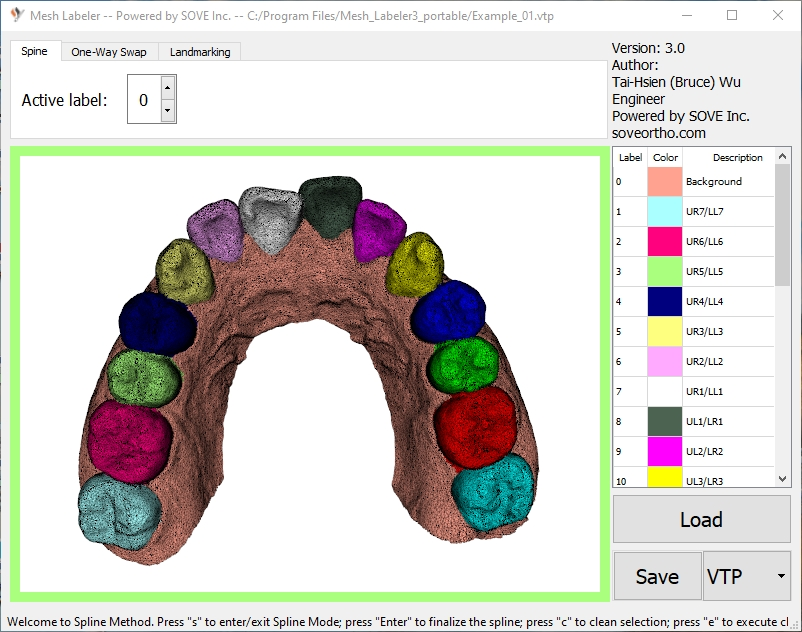

Mesh Labeler – User Manual
==========================
Created by [Tai-Hsien Wu](https://github.com/Tai-Hsien).
This project is mainly based on [Visualization Toolkit (VTK)](https://vtk.org/) and, especially, [vedo](https://github.com/marcomusy/vedo).
==========================

1.  Download the ZIP file from
    <https://drive.google.com/file/d/1CXoIeZvmM6FTorhz8Jj0iImHYPjnONIv/view?usp=sharing>

2.  Extract the ZIP file, and there will be a folder named
    **Mesh_Labeler_win_v1.0**

3.  In the folder, execute **Mesh_Labeler.exe** , the program might take around
    5 seconds to launch. After that, you will see the user interface, as shown
    below.

4.  Use the top-right button to open a mesh file. Now the program supports VTP
    (with an attribute named **Label** , a cell scalar array), STL, and OBJ
    files. There is an examples (Example_01.vtp) in the folder. Note: Since STL and OBJ files do not have the attribute **Label**.
    The program will initially generate the cell scalar array (i.e., **Label**)
    and assign value of 0 (i.e., all background) to the array for each cell
    (i.e., for each triangle) when loading the two types of files. The
    screenshot after loading an appropriate VTP will look like below.

5.  The view on the scene can be changed by using various mouse actions, as
    follows:

-   Rotating the mouse wheel upwards will zoom in, and downwards will zoom out.

-   Holding the middle mouse button down and dragging will pan the scene or
    translate the object.

-   Holding the left mouse button down and dragging will rotate the camera/actor
    in the direction moved.

6.  There are two ways to fix labels, described as follows.

-   1st Fix Way: Change label by selecting cells (triangles)

The simplest way to select cells is to right-click a cell. The selected cells are highlighted by grey color. An advanced way to select cells is to press "s" to enter "Spline model",
 where you can add points by left click on the mesh. Once you decide to use the selected points (number of points should be larger than 2) to generate a spline, press "Enter". All cells within this spline will be highlighted.
 Press "c" to clean the current selection. Before you execute the change, please make sure the *active label* is what you plan to apply. The default *active label* is 0. You can change it in the textbox on the top right.
When you satisfy the selected cells, press "e" to execute the change which assigns the value of *active label* on those selected cells. Please follow the colormap in the bottom window
to assign/fix the label of each cell for a dental tooth model.

-   2nd Fix Way: Change all cells with a specific label number one shot

In this way, we can entirely change cells those labels are a specific value to be
another value. There are two textboxes on the middle-right side. Once they read valid label numbers, click "Change!"
button. Then, all cells with the old label will be changed to be a new label.

7.  Once everything is done, you can save the result by using the **Save VTP
    file** button. The program will save the result in the VTP format with the
    **Label** cell scalar attribute.

